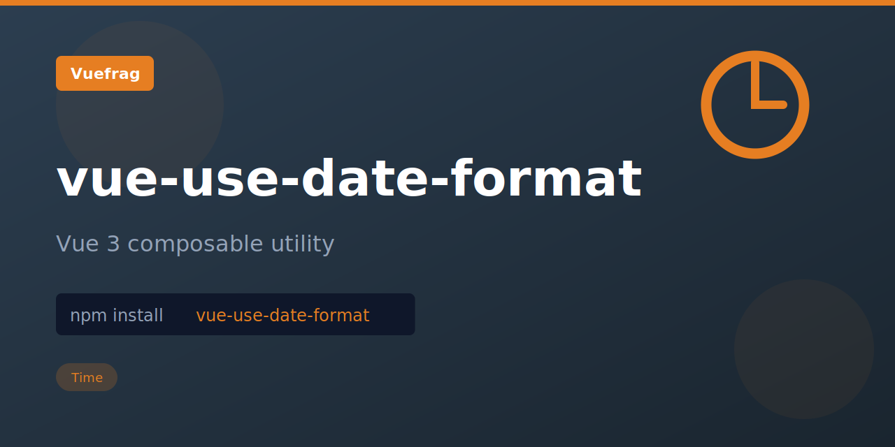

<p align="center">
  
</p>

<h1 align="center">vue-use-date-format</h1>

<p align="center">A Vue 3 composition API utility for formatting dates reactively using format tokens (YYYY, MM, DD, HH, mm, ss, etc.). Supports localization and custom meridiem.</p>

<p align="center">
  <a href="https://www.npmjs.com/package/vue-use-date-format"></a>
  <a href="https://www.npmjs.com/package/vue-use-date-format"></a>
</p>

## Installation

```bash
npm install vue-use-date-format
```

## Usage

```ts
import { useDateFormat } from 'vue-use-date-format'
import { ref } from 'vue'

const date = ref(new Date('2024-01-28 15:30:00'))
const formatted = useDateFormat(date, 'YYYY-MM-DD HH:mm:ss')

console.log(formatted.value) // '2024-01-28 15:30:00'

// Change the date
date.value = new Date('2024-12-25 00:00:00')
console.log(formatted.value) // '2024-12-25 00:00:00'
```

## License

MIT

Extracted from [VueUse](https://vueuse.org/) for standalone use.
